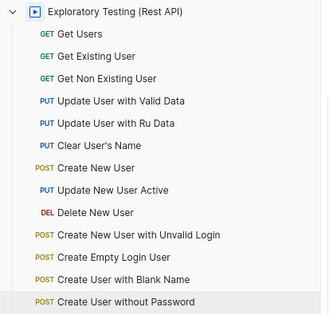

## Тестовое задание на должность "Тестировщик"

Задание было выполнено в ОС Ubuntu через VirtualBox. Ruby версии 3.2.3, IDE RubyMine. 
Для UI тестирования был использован браузер Chrome и его драйвер версии 141. Исследовательское тестирование API проводилось через Postman v11.67.5. 
Решение задания разделено на 3 части: тестирование Web UI, реализация шагов удаления и изменения в API, исследовательское тестирование API.

### 1) Тестирование Web UI.
Решение задания представлено в двух файлах: сценарий ``web_page_test.feature`` и шаги выполнения ``web_ui_steps.rb``.

### 2) Реализация шагов удаления и изменения в API.
Решение задания представлено в двух файлах: сценарий ``rest_api_test.feature`` и шаги выполнения ``rest_tests_steps.rb``.    

### 3) Исследовательское тестирование API.
Цель: Проверка работы реализованных REST API сервисов независимо и в связках.   
Подход: тестирование API проводилось через  Postman.  

#### Наблюдения:
- Простые CRUD операции работают корректно.
- Связки операций выполняются без ошибок (Добавление → Изменение → Удаление; Добавление → Повторное добавление; Удаление → Повторное удаление, включая полный и подробный цикл, реализованный в файле ``rest_api_test.feature``)
- При попытке изменить имя и фамилию пользователя на кириллицу данные сохраняются как ????????????
- Попытка добавить пользователя с кириллицей в логине вызывает 500 Internal Server Error.
- Остальные негативные сценарии обрабатываются корректно: попытка очистить имя пользователя, создание пользователя с пустым логином, создание пользователя без пароля и т.д.
- Повторное добавление пользователя вызывает ошибку 400 Bad Request. Хоть и POST является неидемпотентным методом, поле логин является уникальным и не допускает возникновения дубликатов.

#### Вывод:
API работает стабильно как при стандартных сценариях, так и при большинстве негативных сценариев. Нет поддержки кириллицы, из-за чего данные на кириллице обрабатываются некорректно.
